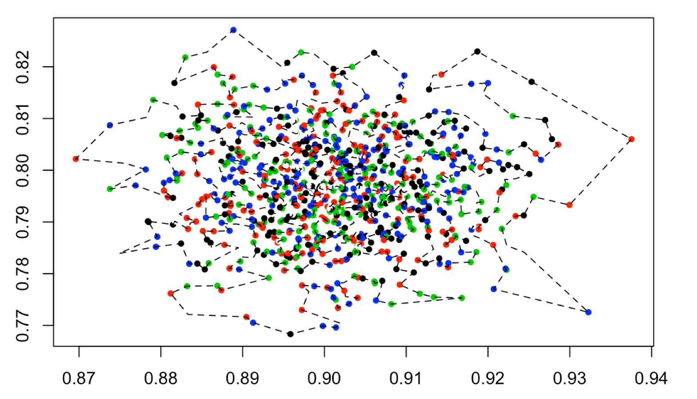

# Challenge
Have you ever hopped on a scooter and realized the battery is dead? What an upsetting experience! 
In order to prevent that horrible user experience from happening, the data science team is focusing its efforts on coming up with the best scooter charging strategy. 

You can find a data set below with scooters’ current geolocation and power level. Power level ranges from 0 - 5 (0 as completely out of battery, 5 as fully charged). It takes 5 hours to charge a scooter’s power from 0 to 5. TechPointX talent team also has a mega charging bus that drives around to pick up scooters and charge them inside. Unfortunately, the bus can only park and start at location 20.19 (xcoordinate), 20.19 (ycoordinate) and only travel 50 miles per hour. 

Please review the data set, and draw any conclusions you can find from the data set. Try to identify the most popular scooter location, demonstrate your findings using data visualization tools, calculate operation time cost (Operation Time Cost: How long it takes to fully charge all the scooters), and come up with the most efficient scooter charging strategy. 

# My analysis
This repository has my full analysis for the above challenge. I create a dynamic document for this analysis using R Markdown. If you are interestm, it's here: http://rpubs.com/sangtruong_2021/XTernDS2019
